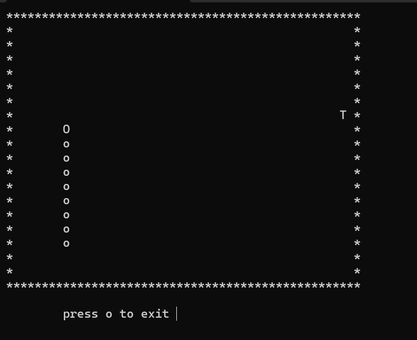
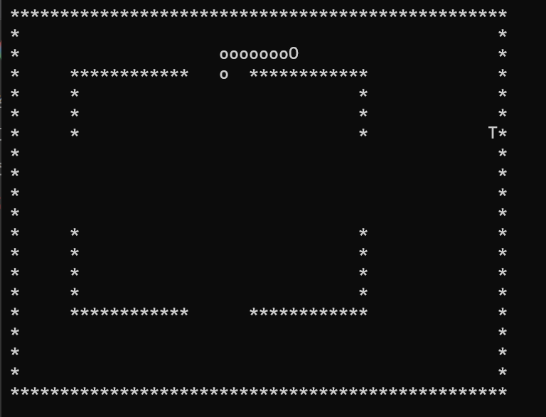

# Console Snake Engine | C++ Terminal Architecture

<p align="center">
  
  
</p>

A lightweight, procedural 2D game engine built entirely in C++ for the Windows command prompt. This project bypasses modern graphic libraries, rendering directly to the terminal using standard input/output streams and utilizing the `windows.h` library for thread sleeping (frame rate control) and `conio.h` for asynchronous keyboard polling.

## 🧠 System Architecture & C++ Implementation

### 1. Array-Based Positional Tracking (Tail Mechanics)
Managing the snake's growing tail without dynamic memory allocation (like Linked Lists or Vectors) requires a highly efficient array-shifting algorithm.
* **Coordinate History Buffer:** The engine maintains two fixed-size integer arrays (`tailx[50]` and `taily[50]`). 
* **The `shiftR` Algorithm:** Every frame, before the head moves, a reverse-iterating `for` loop shifts every stored coordinate one index to the right (`arr[i+1] = arr[i]`). The head's previous position is then saved at index `0`. This mathematically drags the entire tail behind the head in O(N) time where N is the current tail length.

### 2. Input Polling & Directional Safety Logic
Terminal games suffer from an issue where a player moving UP can press DOWN, instantly reversing into their own body and causing an unfair Game Over.
* **Asynchronous Polling:** `_kbhit()` and `_getch()` allow the game loop to read keystrokes without pausing execution, simulating real-time input.
* **Anti-Reversal Matrix:** The game utilizes a 2-element array (`checkk`) to track the *current* direction versus the *requested* direction. If an illegal 180-degree turn is detected (e.g., `Up` is 1, `Down` is 2; if `checkk[0]==1 && checkk[1]==2`), the engine safely overrides the user input and forces the snake to continue its current path, ensuring fair gameplay.

### 3. Procedural Map Rendering Pipeline
The game does not store a 2D map array in memory. Instead, it uses a **Coordinate Evaluation Pipeline** to render the screen on the fly, keeping memory overhead drastically low.
* As the nested `for` loops iterate over the X/Y console coordinates, the engine evaluates the current pixel:
  1. Is this coordinate the boundary? (Draw `*`)
  2. Is this coordinate the Head? (Draw `O`)
  3. Is this coordinate the Fruit? (Draw `T`)
  4. Does this coordinate match any index in the Tail arrays? (Draw `o`)
  5. Else, draw empty space (` `).

### 4. Hardware-Level Collision & Spawning
The project features two distinct maps (Standard and Obstacles). 
* **Coordinate Rejection:** To prevent the fruit from spawning inside a wall on Map 2, the `locmap2T()` function uses a rejection-sampling algorithm. It generates a random X/Y coordinate and checks it against the hardcoded internal wall boundaries. If the coordinate intersects a wall, it rejects the spawn and re-rolls until a safe coordinate is found.

---

## 🎮 Controls & Interface

| Key | Action |
| :--- | :--- |
| **W** | Move Up |
| **S** | Move Down |
| **A** | Move Left |
| **D** | Move Right |
| **O** | Quit Game / Exit to Menu |

## 🚀 Installation & Compilation

To run this engine, compile it using any standard C++ compiler (such as GCC/MinGW) on a Windows environment.

```bash
g++ snake_game.cpp -o snake_game.exe
./snake_game.exe
